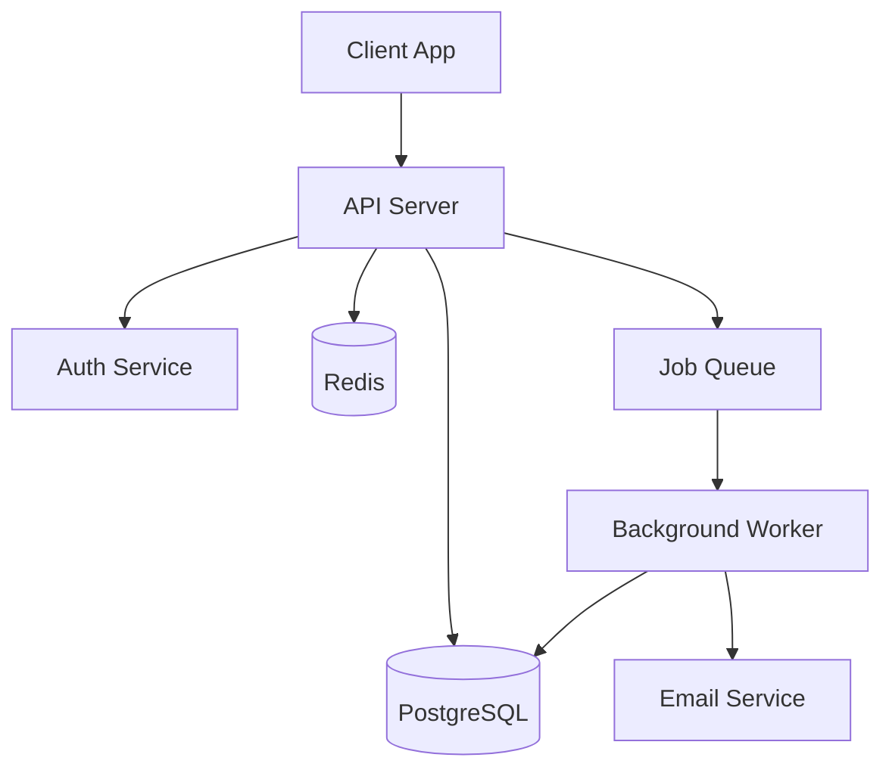

# Technical Documentation Generator

Scan a codebase and generate client-deliverable technical documentation. Produces API docs, READMEs, architecture overviews, changelogs, and developer onboarding guides.

## How to Use

```
/technical-doc-generator ./src api-docs
/technical-doc-generator . full
/technical-doc-generator ./src readme
/technical-doc-generator . changelog
/technical-doc-generator ./src onboarding
```

- `$ARGUMENTS[0]` = Path to codebase (default: current directory)
- `$ARGUMENTS[1]` = Doc type: `api-docs`, `readme`, `architecture`, `changelog`, `onboarding`, `full` (all)

## Documentation Types

### `readme` — Project README

Scan the project and generate a comprehensive README:

```markdown
# Project Name

Brief description (1-2 sentences from package.json, pyproject.toml, or code analysis).

## Features
- [Auto-detected from code structure]

## Quick Start

### Prerequisites
[Detected from package.json, requirements.txt, go.mod, etc.]

### Installation
[Generated from detected package manager and config files]

### Configuration
[Detected from .env.example, config files, environment variables in code]

### Usage
[Basic usage examples from entry points, CLI args, or main functions]

## Project Structure
[Generated directory tree with descriptions]

## API Reference
[Brief overview with link to full docs if generated]

## Contributing
[Standard contributing section]

## License
[Detected from LICENSE file]
```

### `api-docs` — API Documentation

Scan for API endpoints and generate documentation:

1. **Detect the framework**: Express, FastAPI, Django, Flask, Rails, Spring, Gin, etc.
2. **Extract endpoints**: Routes, methods, parameters, request/response bodies
3. **Generate OpenAPI/Swagger spec** (YAML)
4. **Generate human-readable docs** (Markdown)

For each endpoint:
```markdown
### `POST /api/users`

Create a new user account.

**Authentication**: Required (Bearer token)

**Request Body**:
| Field | Type | Required | Description |
|-------|------|----------|-------------|
| email | string | Yes | User's email address |
| name | string | Yes | Full name |
| role | string | No | User role (default: "member") |

**Example Request**:
```json
{
  "email": "user@example.com",
  "name": "Jane Doe",
  "role": "admin"
}
```

**Response** (`201 Created`):
```json
{
  "id": "usr_abc123",
  "email": "user@example.com",
  "name": "Jane Doe",
  "role": "admin",
  "created_at": "2026-02-13T10:00:00Z"
}
```

**Error Responses**:
| Status | Description |
|--------|-------------|
| 400 | Invalid request body |
| 409 | Email already exists |
| 401 | Missing or invalid auth token |
```

### `architecture` — Architecture Overview

Generate an architecture document with:

1. **System overview**: What the system does, high-level description
2. **Technology stack**: Languages, frameworks, databases, services detected
3. **Directory structure**: Annotated tree with purpose of each directory
4. **Component diagram**: Mermaid diagram showing major components and their relationships
5. **Data flow**: How data moves through the system
6. **Database schema**: If migrations or models are found, document the schema
7. **External dependencies**: Third-party services, APIs, databases
8. **Configuration**: Environment variables and their purposes

Mermaid diagram example:


### `changelog` — Changelog from Git History

Parse git log and generate a structured changelog:

```markdown
# Changelog

## [Unreleased]
### Added
- [Features from commits since last tag]

### Changed
- [Modifications]

### Fixed
- [Bug fixes]

## [1.2.0] - 2026-02-10
### Added
- ...
```

Rules:
- Group by semantic version tags (or by month if no tags)
- Categorize commits: Added, Changed, Fixed, Removed, Security, Deprecated
- Parse conventional commits if used (`feat:`, `fix:`, `chore:`, etc.)
- Skip merge commits and build/CI commits
- Link to PRs/issues if references found in commit messages

### `onboarding` — Developer Onboarding Guide

Generate a guide for new developers joining the project:

```markdown
# Developer Onboarding Guide

## Prerequisites
[Required software, versions, accounts]

## Getting Started
### 1. Clone and Setup
[Step-by-step with exact commands]

### 2. Environment Configuration
[All env vars explained with example values]

### 3. Run Locally
[Commands to start the dev server, run tests, etc.]

### 4. Verify Setup
[How to confirm everything is working]

## Codebase Tour
### Architecture Overview
[Brief system description with diagram]

### Key Directories
[What lives where and why]

### Important Files
[Config files, entry points, key modules]

## Development Workflow
### Branching Strategy
[Detected from git history or standard gitflow]

### Running Tests
[Test commands, test structure]

### Code Style
[Linting config, formatting tools detected]

### Making Changes
[Typical workflow: branch → code → test → PR]

## Common Tasks
### Add a new API endpoint
[Step-by-step based on existing patterns]

### Add a database migration
[Based on detected ORM/migration tool]

### Deploy
[If deployment config is detected]

## Troubleshooting
### Common Issues
[Based on README, issues, or common patterns]
```

### `full` — Complete Documentation Package

Generate ALL of the above, organized in a `docs/` directory:

```
docs/
  README.md              # Project README (also copy to project root if none exists)
  API.md                 # API documentation
  ARCHITECTURE.md        # Architecture overview
  CHANGELOG.md           # Changelog
  ONBOARDING.md          # Developer onboarding
  openapi.yaml           # OpenAPI spec (if API detected)
  diagrams/              # Mermaid source files
```

## Codebase Scanning Strategy

1. **Package files first**: `package.json`, `pyproject.toml`, `go.mod`, `Cargo.toml`, `Gemfile`, `pom.xml`
2. **Config files**: `.env.example`, `docker-compose.yml`, CI/CD configs
3. **Entry points**: `main.*`, `index.*`, `app.*`, `server.*`
4. **Route/endpoint files**: Files containing route definitions
5. **Models/schemas**: Database models, TypeScript interfaces, Pydantic models
6. **Test files**: To understand expected behavior
7. **Existing docs**: Any existing README, docs/, wiki content

Do NOT read every file. Be strategic — scan structure first, then dive into key files.

## Output

Save all generated docs to `output/docs/` (or `docs/` if specified). Present a summary of what was generated and suggest next steps for the client.
